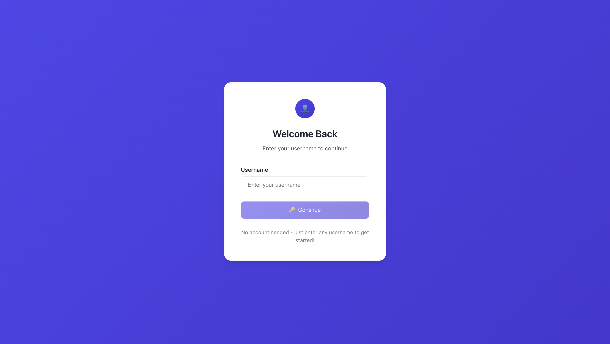
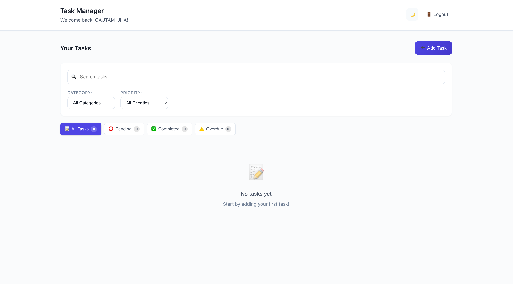

# Personal Task Tracker

## 📖 Description
A simple, responsive personal task management app built with React. Easily add, edit, delete, and filter your tasks. Designed for the Intern Pre-Hire Assignment.

## 🚀 Features
- Simple login (username stored in localStorage)
- Add, edit, and delete tasks
- Mark tasks as completed or pending
- Inline or modal editing
- Task filtering: All, Completed, Pending (with counts)
- Task creation date/time display
- Visual distinction for completed vs. pending tasks
- Data persistence with localStorage
- Responsive design for mobile and desktop

## 🛠 Setup Instructions
1. Clone the repository:
   ```bash
   git clone https://github.com/JHAJI01/RYGNeco_Work.git
   cd RYGNeco_Work
   ```
2. Install dependencies:
   ```bash
   npm install
   ```
3. Start the development server:
   ```bash
   npm start
   ```
4. Open [http://localhost:3000](http://localhost:3000) in your browser.

## 🧰 Technologies Used
- React.js
- Vite
- CSS


## 🌟 Bonus Features 
- Search tasks
- Task priority levels
- Due dates
- Animations/transitions
- Dark mode
- Task categories/tags

---

## 📦 Project Structure
```
src/
  components/
    Login.jsx
    TaskForm.jsx
    TaskItem.jsx
    TaskList.jsx
    TaskFilter.jsx
  utils/
    localStorage.js
  styles/
    App.css
  App.jsx
  index.jsx
```

---

## 📬 Submission
- GitHub repository: https://github.com/JHAJI01/RYGNeco_Work.git

- Live demo (Vercel): https://ryg-neco-work.vercel.app/

---

## 🖼 Screenshots



---
